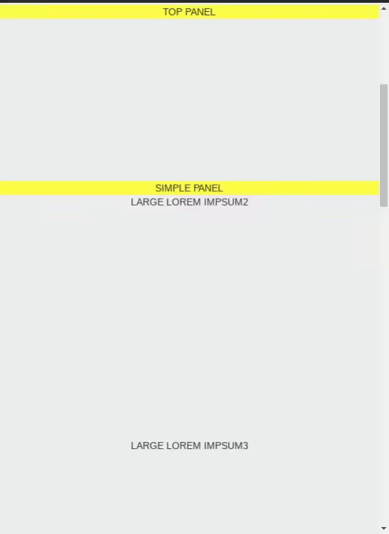

# ngx-scroll-to-top
An Angular Library used when a given element needs to stick to the top of the page.  

To explain in detail, suppose there is a div which needs to be scrolled as usual,
but when it reaches top of the page you want it to stick at top of the page.

Then this Angular Directive is what you need.

### Example : 


## Installation

Install via [NPM](https://www.npmjs.com/package/ngx-scroll-to-top) using

```bash
$ npm install ngx-scroll-to-top --save
```

## Usage: 

```html
    <div scroll-to-top (toTop)="triggerOnTop($event)">
        SIMPLE PANEL
    </div>
```

Taking advantage of Output Events from Angular, following can be done.

```typescript

@Component(...)
export class Component {
    
    triggerOnTop(isOnTop: boolean) : any{
        console.log(isOnTop);
    }    
}
```

As you get an handle of trigger whenever given element reaches top of the page, 
 - one can add custom classes to your panel using `[class.customClass]="booleanOfIsOnTop"`
 - one can update the text/add menu buttons to it.


## LICENCE
MIT © [Lalit](mailto:lalit.umbarkar9@gmail.com)

